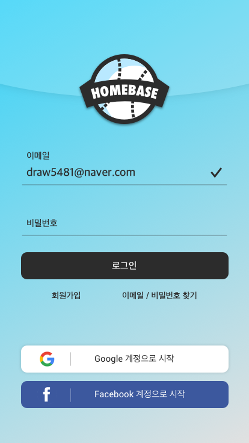
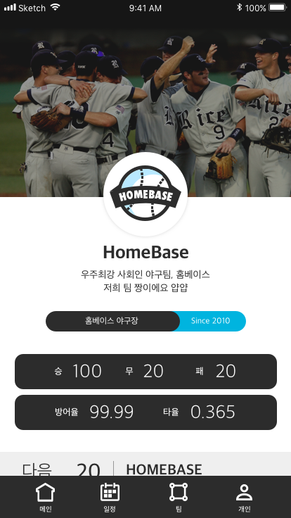
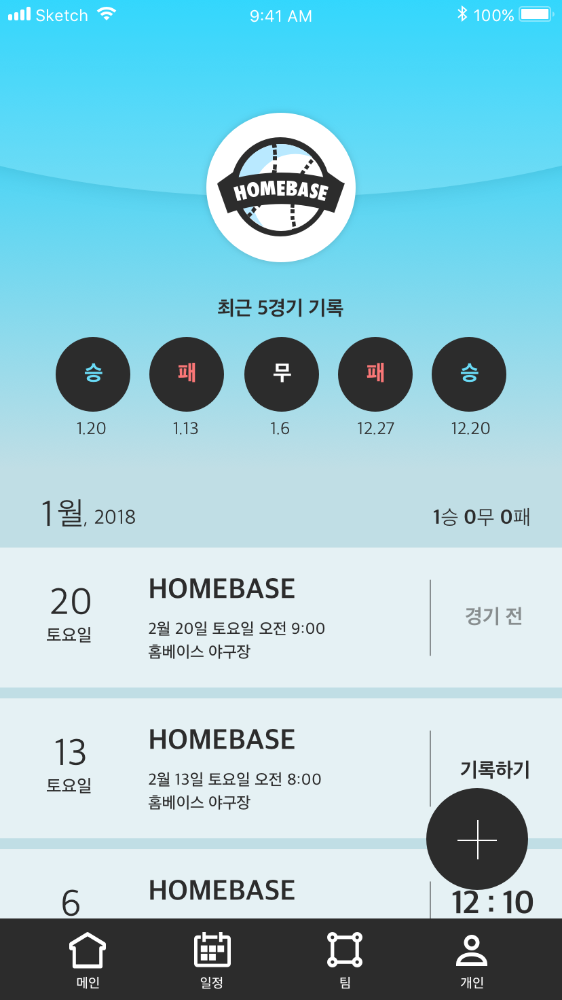
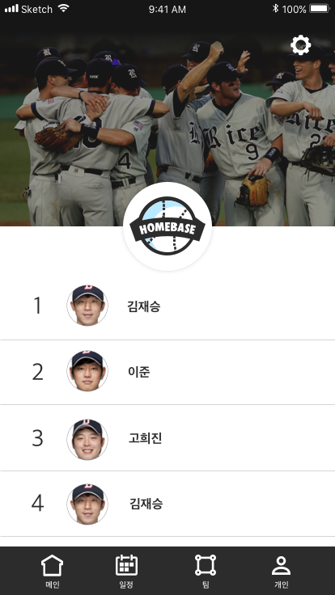
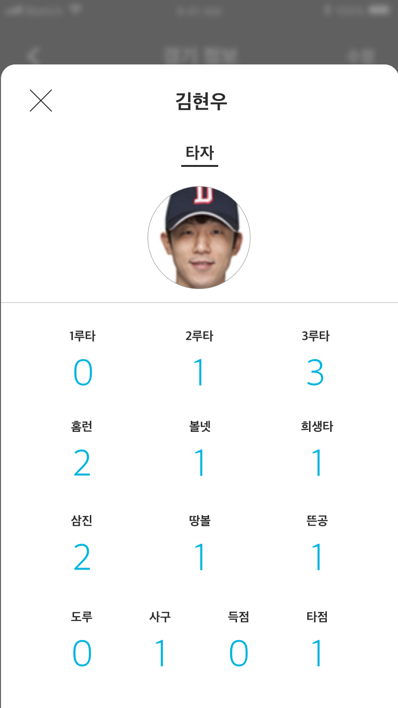

# HomeBase iOS

**2018 상반기 배포 예정**

사회인 야구팀을 위한 경기 스케줄 및 경기 결과 관리 앱!  
내가 어제 안타를 몇 번 쳤지? 다음주 목요일에 경기 있었나? 더 이상 고민하지 마세요! Home Base 앱은 당신의 팀 경기 스케줄과 경기 결과를 최대한 간편하고 쉽게 관리해줍니다.

      

---

**사용 기술**
- Swift4
- Firebase
  - Auth
  - Database (json)
  - Storage
  - Cloud Function
- Alamofire (json)
- Kingfisher (사용 예정)

**UI**
- Auto Layout (iPhone SE ~ iPhone X 대응)
- Navigation Controller, TabBar Controller
- 다양한 Custom TableView
- TransParentView

**특징**
- [iOS 기술명세서](https://docs.google.com/spreadsheets/d/1vILd8QsK1fMbLzOIpYIirNZCjOvSfQpEvOqGKyNJH74/edit?usp=sharing)
- 수많은 데이터를 보기 편하게 사용자 입장에서 생각한 UI 구성
  - Storyboard와 Code를 모두 사용해서 구현
- json data를 받아와 table view에 적용
- 일정 간격으로 refactoring을 통해 중간 점검, 버그 수정, 최적화
